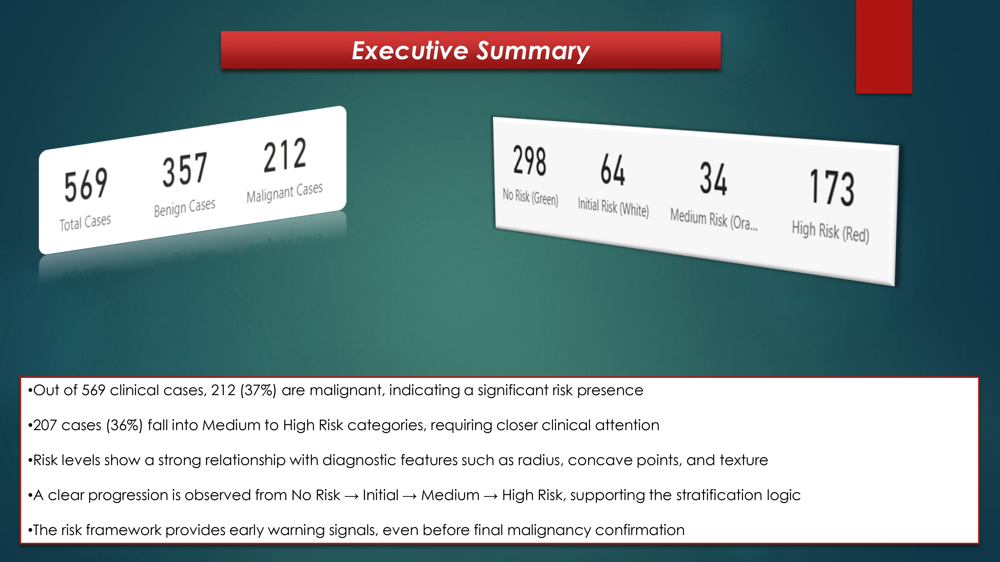

🧬 Clinical Risk Stratification for Breast Cancer

 
📌 Overview
This project analyzes breast cancer diagnostic data to identify risk patterns and stratify patients into different risk levels using Power BI.

🎯 Project Objectives
•	Identify key diagnostic features related to breast cancer
•	Classify patients into No Risk, Initial, Medium, and High Risk
•	Analyze how risk evolves across multiple features
•	Provide early, explainable risk signals

📊 Key Metrics
•	Total Cases
•	Benign vs Malignant Cases
•	Risk Distribution (No Risk → High Risk)
•	Feature-based Risk Analysis

📈 Key Insights
•	Out of 569 cases, 212 (~37%) are malignant
•	Around 36% fall into Medium to High Risk categories
•	Strong relationship between risk and features like radius, texture, and concave points
•	Risk increases gradually across categories, not suddenly

🧠 Business / Clinical Insights
•	Risk can be detected early before final diagnosis
•	Multi-feature analysis improves decision accuracy
•	Provides explainable risk signals (not black-box)
•	Supports clinicians in decision-making

🛠 Tools & Technologies
•	Power BI
•	Data Modeling
•	DAX
•	Clinical Dataset (Excel)

🚀 Project Value
•	Early risk detection framework
•	Improves healthcare decision-making
•	ML-ready structured dataset
•	Converts raw clinical data into actionable insights

👤 Author
Hamid Alam
Data Analyst | Power BI | SQL | Python
📍 Vienna, Austria

